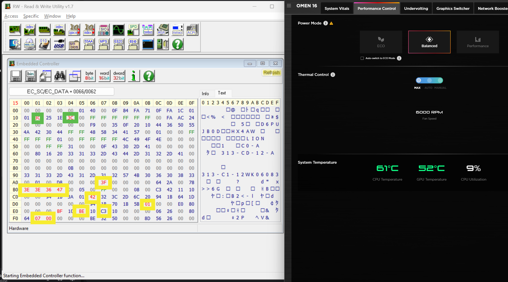
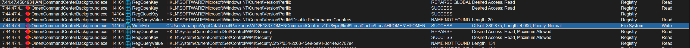
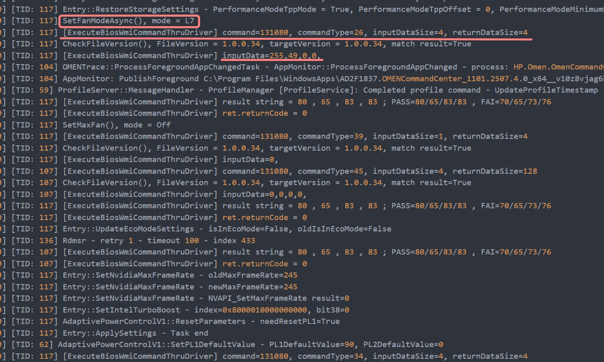

# How I Ended Up Sending In My First Linux Kernel Patch

I recently bought an HP Omen 16. It’s a powerhouse, packing a 13th Gen i9 and an RTX 4060. On Windows, it was everything I expected while under load, the Omen Gaming Hub would spin the fans into a satisfying roar, keeping the high-end components cool and performance maxed out.

But on Linux, my daily driver, the machine was silent. And not in a good way. The fans were stuck in a low hum, performance was choked by thermal throttling, and the power I knew the machine had was locked away. I had a high-performance laptop that couldn't perform. This wasn't just an annoyance; it was a puzzle I needed to solve.

## Part 1: Down the Rabbit Hole of the Embedded Controller

My first instinct was to turn to the standard Linux utilities. But `lm-sensors` found no fan controls, and `pwmconfig` bluntly informed me that no PWM-capable devices existed. It was my first hard lesson: modern laptops don't use simple, standardized controls.

Some online digging pointed me toward the **Embedded Controller (EC)**, a microcontroller on the motherboard that manages low-level tasks like power, batteries, and, yes, fans. The theory was that if I could figure out how to "speak" to the EC, I could control the fans directly. This led me down my first rabbit hole.

I tried taking multiple snapshots of the EC memory state, toggling settings on and off, and then diffing the results to filter out the noise. After hours of this, the only bytes that consistently changed were at addresses `0x11` and `0x14`. They seemed to directly reflect the fan speeds. But while I could write to these addresses on Windows to manually set the fans, they were completely unresponsive on Linux.

I spent an embarrassing amount of time with tools like RWEverything on Windows, which gave me a real-time view of the EC's memory. My screen looked like a conspiracy theorist's board, with boxes drawn everywhere, tracking bytes as they flickered.

I had a moment of hope when I found that writing `0xFF` to address `0xB7` on Linux made the fans spin up\! But it was only a slight increase, nowhere near their full speed. This "almost-working" state was more maddening than if it had done nothing at all. I had hit a wall.

## Part 2: A Change in Strategy - Spying on the Omen Hub

Frustrated with the low-level approach, I decided to change tactics. The OMEN Gaming Hub on Windows had full control, so I needed to figure out _how_. I booted back into Windows and started what would become a deep dive into reverse engineering.

My first tool was dnSpy, a .NET decompiler. I pointed it at the Omen Hub's application files and was immediately overwhelmed. The code was a pile of spaghetti, checking conditions for hundreds of different HP board models. Trying to trace the logic for my specific board (`8BAB`) felt impossible. I was lost.

But amidst the confusion, I noticed something: the code was logging. _A lot_.

This was the real turning point. If the application was logging its actions, I didn't need to understand all its internal logic; I just needed to find the logs. I fired up Process Monitor (ProcMon), a powerful tool that shows real-time file system activity. I set a filter for the Omen Hub's background processes, toggled the fan settings, and watched. There it was, a flurry of write activity to a specific log file tucked away deep in the system folders.

## Part 3: The Rosetta Stone and the WMI Connection

That log file was my Rosetta Stone. I opened it and saw a flood of commands the app was sending. It was still noisy, but by comparing the logs before and after changing performance modes, I could isolate the most important calls. I finally understood that the app wasn't talking to the EC directly; it was using a high-level Microsoft API called **Windows Management Instrumentation (WMI)**.

The logs showed the exact WMI calls for my board. To enter **Performance Mode**, it sent the command `0x1A` with the data `0x31`. Other calls were happening constantly, like a mysterious call to command `0x23`, whose purpose I still don't fully understand, but `0x1A` was the clear signal for changing the power profile.

Suddenly, everything clicked. The Linux kernel has its own implementation to handle these proprietary calls: the `hp-wmi` driver. The reason it wasn't working for me was that my board's specific commands weren't known to the driver. My problem wasn't a missing driver; it was an incomplete one.

## Part 4: From Knowledge to Action - Crafting a Kernel Patch

Armed with the correct WMI commands, I could finally read the `hp-wmi.c` source code and understand what it was doing. I saw how it supported other HP models and realized my `8BAB` board behaved almost identically to the "Victus S" line of laptops, with the crucial difference being the specific byte values used for performance modes. They recently got this newer [patch](https://lore.kernel.org/all/1c00f906-8500-41d5-be80-f9092b6a49f1@free.fr/) which was helpful in understanding how to implement my changes.

The solution was to write a kernel patch. At a high level, the changes were straightforward:

1.  **Add my board ID (`8BAB`)** to the list of models that use the newer control method.
2.  **Add the new performance mode values** (`0x31` for performance, `0x48` for balanced) to the driver.
3.  **Modify the performance-setting function** to check for my board and send the correct values.

After a lot of trial and error with building a custom kernel module on NixOS without rebuilding the entire kernel, I finally got the patch to apply cleanly. I rebooted, and for the first time on Linux, I had control. The `platform_profile` file appeared in `sysfs`, and I could read real RPMs from the fans.

## Part 5: The Final Boss - The NVIDIA Power Puzzle

I had platform profiles and fan readings, but one last mystery remained. On Windows, setting Performance Mode unlocks the NVIDIA GPU's power limit from 80W to 140W. On Linux, even after setting the profile, the GPU was stubbornly capped at 80W under load.

This led to another round of intense debugging. It turned out that on NixOS, I needed to enable NVIDIA's Dynamic Boost. This correctly changed the _reported_ maximum power limit to 140W in `nvidia-smi`. However, when I ran benchmarks, the _actual_ power draw never went above 80-85W. I was stumped again, thinking something was still limiting it.

As a final sanity check, I went back to Windows and ran the same heavy benchmarks. To my surprise, it behaved almost identically. The GPU only drew more than 80W under very specific, sustained workloads, and often settled in the same 80-90W range due to thermal and other system-level constraints.

This was the final piece of the puzzle. My patch _was_ working perfectly. My Linux setup was now mirroring the true behavior of the hardware on Windows.

My laptop was finally free.

I submitted my [patch](https://lore.kernel.org/platform-driver-x86/20250731213529.27378-1-noahpro@gmail.com/T/#u) to the Linux kernel mailing list and hopefully it will be accepted in.

This entire process, from knowing nothing about Embedded Controllers to submitting a patch to the Linux kernel, was a challenging but incredibly rewarding experience. It's a testament to the fact that with persistence and the open nature of Linux, you can dig in and fix things, making the hardware you own truly yours. Tinker, explore, and don't be afraid to get your hands dirty.
