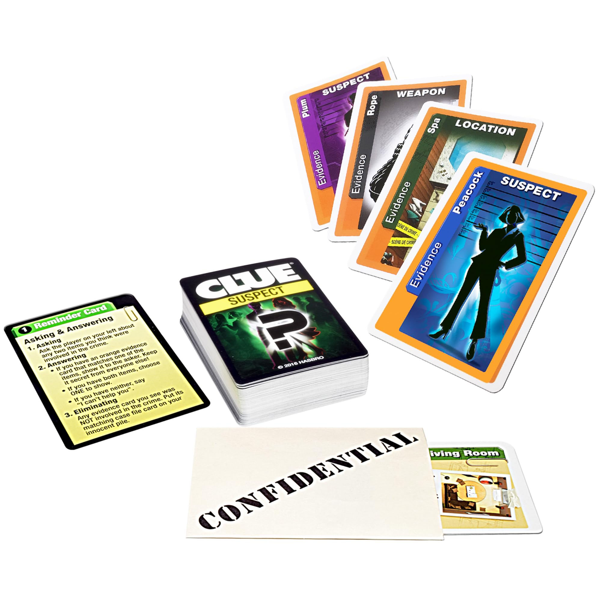

# Uncover: Building a Fast, Social Deduction Multiplayer Game

## The spark

We started Uncover after I showed my friend **Rituraj** a board-less version of Clue that only uses the cards. It was ridiculously fun and there wasn’t a good way to play it online. So we built one. The loop is quick: investigate two things, pass the turn, think fast, read people. It’s deduction with a social heartbeat.

{ width=50%}

The following are individual stories that capture some of the more interesting moments in the development of Uncover.

## The first prototype

I spun up a **Rust Tonic** backend to own game state; Rituraj got a simple **Typescript React** frontend working. The very first UI was just a single horizontal row of cards you could reorder by dragging them around. Basically how your real-life hand works when you’re holding \~15–17 cards. Primitive but playable, exactly what we needed.

## Real-time with types (a small team’s friend)

We wanted actions to show up for everyone **immediately**, so we chose **gRPC**. The frontend tooling wasn’t as cozy as OpenAPI for Typescript (auth in particular wanted some creative glue), but the **strong types** were worth it. For a small team, types let you **manage a lot more complexity** without drowning in edge cases. Through development gRPC over "nothing" kept us fast and sane.

## The "drag anywhere" moment

I argued for **dragging cards anywhere** on a big play area with no rigid piles, just a sandbox. Rituraj was hesitant. We tried it and players loved it. It became the identity of Uncover: creative freedom with the constraint that there’s only one card per item. A small risk can definitely define the whole feel of your game.

## Shuffle chaos, bot bliss

I wrote the bots in **Rust** in two days—basically how _I_ play: solid deduction, no induction. They’re beatable but not pushovers, and writing them was stupidly fun. Meanwhile, we discovered our dealing **wasn’t truly shuffled** for a while. It looked random-ish, but there was a pattern; Rituraj subconsciously learned it and exploited it. We fixed it—and kept the story. Lesson: check the obvious (randomness is not a vibe, it’s a test).

## The "border timer" that broke

We wanted a colored **border timer** that wipes around the play area. Our first "clever" CSS approach (angles from center) fought us nonstop. We found that it even was grinding our app to a halt eventually with a serious memory leak.

The fix was boring and simple: **three bars with rounded corners** that animate widths over time.

Once a user’s timer "broke" entirely. It wasn't showing at all even after debugging everything looked fine. It turned out their **system clock** was wrong, and our timestamp logic suffered. We didn't think utc would be different if your computer thought it was in a different timezone. But we ended up leaving this alone. I notice this same kind of bug on Google calendar all the time, so it’s not just us.

## PWA quirks, iOS link weirdness, and hosting musical chairs

We shipped a **PWA**. On iOS, links from outside wouldn’t open the PWA, they’d open the site. We detect the context, nudge "open in app," and rely on **shared localStorage** so it still feels smooth. Our hosting wandered: frontend on **Vercel** with backend on **DigitalOcean**, then deploys on **Cloudflare**, and eventually I self-hosted the backend on a **Raspberry Pi** at home because… we could. We definitely found it best to ship the path of least resistance, then refactor the runway under the plane. I had to fight rust inside of docker to get it to not take 10 minutes to build on each push. Docker has a newer cachix for buildkit which ended up solving this for us.

{ width=50% }

## When to stop fixing what only devs see

We save **every card move to localStorage** so your layout persists on refresh (the server doesn’t care about positions). That gets weird if your **screen size changes**—which happens a lot if you live in Chrome DevTools like we do. We each burned _days_ "fixing" it. Then we realized: **regular players don’t hit this**. No one has ever complained.

## The tutorial we loved and cut

We built a guided tutorial with a hovering spark that told you what to do and then made you do it.

{ width=50% }

New players **hated** it. We added a skip button, but they would never know what was going on in the game and struggle. We replaced it with a **short, to-the-point "How to Play"**. This was where we learned to listen to players early; we almost shipped something that made the game harder to enjoy.

## Looking back

I realize that this is my favorite piece of software I’ve ever written. Mostly because making it was fun, and playing it now is even more fun, crafted with a lot of love by the two of us.

Build the thing _you_ want to play. Ship the smallest playable version, then sharpen the loop. Let types carry weight for a tiny team. Simpler is sturdier. And when players talk, change the game.

Some special thanks to

- **Rituraj** for being an amazing co-founder and friend
- **Seth** and **Elijah** for playtesting and feedback
- **Dan** for being first and longest customer

---

## Play today

Jump in and start deducing. You can play solo with bots or with friends.

**Player-facing features**

- **Public & private matches** with **invite-by-link**
- **Ready-up** flow for quick starts
- **Google sign-in**
- **Leaderboard with Elo**
- **Push notifications**
- **Audio settings**
- **Bots** for solo practice or filler
- **Themes** (e.g., Deadwood, Nova-3, Beach Resort, Arctic Institute, Astralheim, Ironvale, Marauder’s Keep)
- **Uncover Plus** unlocks **all themes** and **8-player lobbies**

Play now at [uncovercardgame.com](https://uncovercardgame.com).
